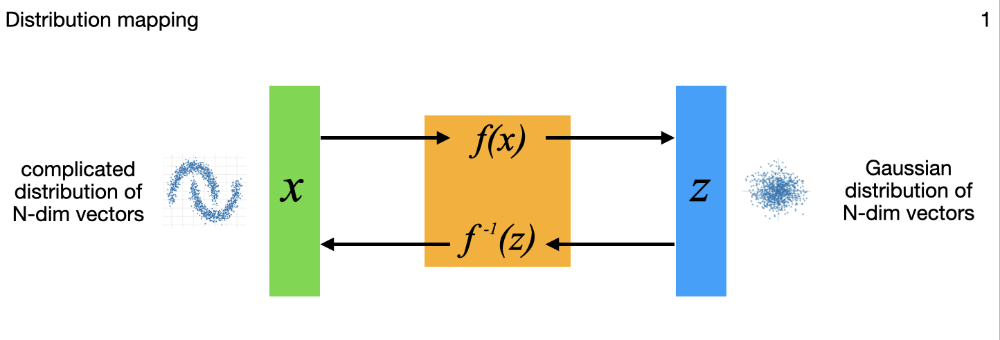

# flow_models

Normalizing-flow models are invertible neural networks (INNs) — a type of
generative model that allows not only generating new samples from the learned
distribution (which GANs and VAEs do too) but also exact likelihood computation
as well (which GANs and VAEs do not).  This is accomplished with an
architecture that ensures all transformations are reversible and the Jacobian
determinant is efficiently computable.  By modeling probabilities directly,
INNs allow for a range of other applications too - a real Swiss-army-knife of
the modeling world that I'm recently fascinated with.  



These normalizing-flow models transform complex data distributions into more
tractable ones (usually Gaussian) in which it's feasible to do probabilistic
calculations such as anomaly detection for example.  But these models allow far
more than anomaly detection - their capabilities allow INNs to cover generative
image modeling, generative classification, parameter estimation on
ill-conditioned problems, and (ill-posed) inverse problems with or without
noise on the data.  All of these stem from the theme of mapping one probability
distribution into another.

Other implementations of INNs I've seen out there only cover one specific
application and with a lot of bespoke code.  But the Tensorflow Probability
package provides almost everything needed to implement these models in a more
encapsulated, cleaner, and easier to understand way (at least for me!).  Of
course as I expand this work I'm wrestling a number of tradeoffs in what to
generalize/simply via TFP and what to explicitly implement - part of the
learning process for me.

The above diagram summarizes, for different applications, variations in how the
N-dimensional model inputs are mapped through the flow model to N-dimensional
outputs that include a latent multivariate standard normal distribution to
capture some or all of the complex variations on the input side.  All those
output points can each be mapped back though the model to the inputs as well,
important in the image generation, uncertainty quantifaction, and inverse
problems among others.  The little images in each frame of the gif are subtle
references to the example applications I'm implementing for each variation, and
key research papers from the literature that describe these variations one at
a time.  Sorry, I acknowledge that at this summary level I'm not currently
describing what all those little images and details are yet; the papers are
referenced at the bottom of this readme though.

Work is currently still in progress - I'm gradually implementing the series of
7 applications in the figure - currently #2 is fully implemented (documented
at
["Flow_models 2: Image generation and anomaly detection as two sides of the same coin"](http://research.ganse.org/datasci/flow_models/flow_models_2.html),
and as the first comprised the bulk of the work - the rest are variations using
same modeling code).  Instructions for using/running that follow below, and
similar ones are upcoming for the other applications as well.  Point being,
it's all the same model, just with a few variations in the partitioning of the
inputs and outputs.  The overview/introduction article to the series is also
available, at
["Flow_models: Overview / Introduction"](http://research.ganse.org/datasci/flow_models).


### A. To install/prepare
1. For full runs on a GPU-enabled EC2 instance I recommend following
   [these instructions](https://github.com/aganse/py_tf2_gpu_dock_mlflow/blob/main/doc/aws_ec2_install.md)
   from my [py_tf2_gpu_dock_mlflow](https://github.com/aganse/py_tf2_gpu_dock_mlflow)
   repository to set that instance up.  A GPU instance is recommended for the
   image based application runs.

   The 2D and 3D data-points based application runs (applications 1, 4, 5)  are
   fine on a cheap CPU instance (I've been just running on a t3.small for those).

   I haven't gotten to the later-numbered application runs yet but I'm guessing
   either a longer t3.small run or running on a higher t3 CPU instance for
   application 6.  And likely GPU instance for wave-based inverse problem in
   application 7.

   I've been experimenting with some scripts in subdir `awsbatch-support` to
   kick off the training remotely in a Docker container via AWS ECR using AWS
   Batch.  But that's not all ready/settled yet, so you can ignore that subdir.

2. Create the python environment and install dependencies:
    ```
    > make create-env
    Creating/installing new python env /home/ubuntu/src/python/flow_models/.venv3
    ```
    (this is just a convenience macro to run the usual `python3 -m venv .venv &&
    source .venv/bin/activate && pip install -r requirements.txt`.  except note
    this macro creates new .venvN subdirectories incrementing N to avoid
    overwriting existing env subdirectories.)

3. Get images if using image applications like in applications 2 and 3:

    Of course you can use whatever images you want.  For my experimentation I
    used the really nicely curated Kaggle dataset
    [animal-faces](https://www.kaggle.com/datasets/andrewmvd/animal-faces)
    which contains approx 5000 cats, approx 5000 dogs, and approx 5000 misc
    wild animals (fox, leopard, lion, tiger, wolf, etc).

    If using a dedicated GPU-enabled instance, you could save these image files
    directly on that instance in a `data` subdir within the `flow_models` repo
    directory.  For that case the URIs for train_generator and other_generator
    in train.py can simply be `"data/train"` for example.  Or you can use image
    files in an S3 bucket, whether in the dedicated GPU-enabled instance or
    in a batch configuration.  For that case the URIs should have the form
    `"s3://mybucket/myprefix/train"`.

    This is not supervised learning so labels are not used for training, but
    it can still be useful to reserve some validation data to experiment with
    after training anyway.  Whether locally or in S3, I find the following
    directory structure helpful.  Note the data generator reading the files
    will combine all subdirectories of files together, so `cat` and `beachball`
    images will be mixed together in the validation dataset:

    ```
    data/                <-- or s3 bucket at this level
        train/
            cat/
        val/
            beachball/   <-- these show up as outliers in gaussian latent points
            cat/         <-- these don't
    ```

### B. To run the training
1. Enter the python environment created above if not already in:  `source .venv/bin/activate`
2. Set environment variable `export TF_CPP_MIN_LOG_LEVEL=2` to squelch a number of status/info lines spewed by Tensorflow and Tensorflow
    Probability (TFP) that I don't find too helpful and that make a mess in the console output.  (Similarly note I've put a python line
    at the top of train.py to squelch `UserWarning`s that are spewed by TFP.)
3. Set desired parameters in `train_flowmodelsN.py` (where the `N` is the number
    of the application 1-7, ie working towards 7 train scripts for the 7
    applications.
4. Run `python train_flowmodelsN.py` (again where `N` is the application number).


### C. Key references

* Distribution mapping and generative image modeling with INNs
  - [RealNVP paper](https://arxiv.org/pdf/1605.08803)
  - [NICE paper](https://arxiv.org/pdf/1410.8516)
  - [Glow paper](https://arxiv.org/pdf/1807.03039)

* Generative classification and ill-conditioned parameter estimation with INNs
  - [Ardizzone 2019 INNs paper](https://arxiv.org/pdf/1808.04730)

* Bayesian inverse problems with INNs
  - [Zhang & Curtis 2021 JGR paper](https://agupubs.onlinelibrary.wiley.com/doi/pdfdirect/10.1029/2021JB022320)

* TensorFlow Probability components
  - [tfp.bijectors.RealNVP API](https://www.tensorflow.org/probability/api_docs/python/tfp/bijectors/RealNVP)


### D. Misc other notes and refs that I perused

* A RealNVP tutorial found in Github:  https://github.com/MokkeMeguru/glow-realnvp-tutorial/blob/master/tips/RealNVP_mnist_en.ipynb

* Kang ISSP 2020 paper on NICE INNs:  https://jaekookang.me/issp2020/

* Eric Jang Normalizing Flows Tutorial:  https://blog.evjang.com/2018/01/nf2.html

* Lilian Weng Flow-based Deep Generative Models tutorial:  http://lilianweng.github.io/posts/2018-10-13-flow-models

* Jaekoo Kang's flow_based_models NICE & RealNVP repo:  https://github.com/jaekookang/flow_based_models

* Jaekoo Kang's INNs repo (Ardizzone implementation):  https://github.com/jaekookang/invertible_neural_networks

* Chanseok Kang's RealNVP notebook:
    https://colab.research.google.com/github/goodboychan/goodboychan.github.io/blob/main/_notebooks/2021-09-08-01-AutoRegressive-flows-and-RealNVP.ipynb#scrollTo=NNun_3RT3A56

* RealNVP implementation example in Stackoverflow:
    https://stackoverflow.com/questions/57261612/better-way-of-building-realnvp-layer-in-tensorflow-2-0

* Brian Keng's Normalizing Flows with Real NVP article, more mathematical:
    https://bjlkeng.io/posts/normalizing-flows-with-real-nvp/#modified-batch-normalization

* Helpful rundown of bits-per-dimension in Papamakarios et al 2018 paper
    "Masked Autoregressive Flow for Density Estimation": https://arxiv.org/pdf/1705.07057
    section E.2; note they call it "bits per pixel".  They express in
    average log likelihoods too (note that's actually what the NLL value
    is at very bottom of this script here).

* Note in NICE paper regarding flow_steps: "Examining the Jacobian, we
  observe that at least three coupling layers are necessary to allow all
  dimensions to influence one another. We generally use four."  And they
  used 1000-5000 nodes in their hidden layers, with 4-5 hidden layers per
  coupling layer.
