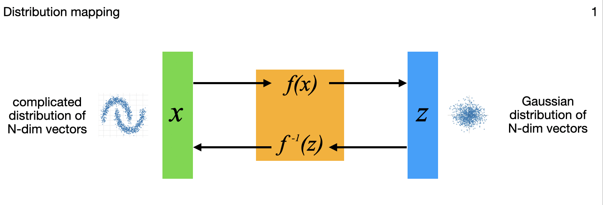

# flow_models

Normalizing-flow models are invertible neural networks (INNs) - generative
models that provide exact likelihood computation (unlike GANs and VAEs) by
ensuring all transformations are invertible with efficiently computable
Jacobians.  This enables generative image modeling, anomaly detection,
classification, parameter estimation, and Bayesian inverse problems - all
from the same architecture, just with different input/output partitioning.
INNs allow for such a range of applications - a real Swiss-army-knife of
the modeling world that I'm recently fascinated with.  



These normalizing-flow models transform complex data distributions into more
tractable ones (usually Gaussian) in which it's feasible to do probabilistic
calculations.  The diagram above shows seven such applications; each frame's
details reference an example and a key paper (cited at the bottom of this
README).  The implementation here uses TensorFlow Probability, which provides
clean building blocks for these models.  I've been jotting up some writeups on
each case on my website as I experiment with it:
- ["Flow_models: Overview / Introduction"](http://research.ganse.org/datasci/flow_models)
- ["Flow_models 1: Distribution mapping"](http://research.ganse.org/datasci/flow_models/flow_models_1.html)
- ["Flow_models 2: Generative image modeling"](http://research.ganse.org/datasci/flow_models/flow_models_2.html)


## A. Prep/Setup

### Platform Options
To train the models in this repo you have a number of options for platforms, CPU or GPU in all:
1. locally in a Python venv without Docker (on own machine or cloud instance)
2. locally in a Docker container (on own machine or cloud instance)
3. cloud training via SageMaker Training Jobs (for full single runs)
4. cloud training via AWS Batch (for queued/parallel job sweeps)

Local runs (options 1-2), whether in a Python virtual environment or in a Docker
container, could either be on an average home machine or on a GPU-enabled machine
or EC2 instance.  To do the latter in AWS, for convenience you could follow [these
instructions](https://github.com/aganse/py_tf2_gpu_dock_mlflow/blob/main/doc/aws_ec2_install.md)
to quickly configure a GPU-enabled EC2 instance.  For submitted cloud runs (options
3-4), no EC2 setup is needed - training runs entirely up on independent AWS services.

For local runs without Docker (option 1), you'll need to create a python virtual
environment and install the dependencies:
```
make create-env             # creates .venvN and pip-installs requirements.txt
source .venvN/bin/activate  # enter desired venv (N increments with each create-env call)
make install-dev            # if wish to do dev/tests/linting (installs requirements-dev.txt)
```
Installing that python environment is not needed for Docker or cloud runs -
dependencies are baked into the Docker image.

### Training Data
For training images (for image-based applications like `train_flowmodels2.py`),
of course you can use whatever images you want.  For my example experimentation
I used the nicely curated Kaggle dataset
[animal-faces](https://www.kaggle.com/datasets/andrewmvd/animal-faces) which
contains ~5000 cats, ~5000 dogs, and ~5000 misc wild animals (fox, leopard,
lion, tiger, wolf, etc).

- for local runs (options 1-2): place images in some directory (e.g. `data/`) and
  set `IMAGES_PATH` to that path.
- for cloud runs (options 3-4): upload to S3 and set `IMAGES_PATH=s3://mybucket/prefix`.

Use the following directory structure in `data/` (but note subdirectories are
merged by the data generator, so `cat` and `beachball` images mix together in
the below).  This is not a supervised learning model so labels are not used for
training, but for validation this directory structure provides a convenient
labeling of what images contain what in the dataset.
```
data/                <-- or s3://mybucket/prefix/
    train/
        cat/
    val/
        beachball/   <-- these show up as outliers in latent space
        cat/         <-- these don't
```


## B. Running the Training

Follow the directions for the respective run option (same numbers as the list
above in section Platform Options, click to open that section).  Also note that
[doc/all_makefile_targets.md](doc/all_makefile_targets.md)
lists all the makefile targets from top-level, SageMaker, and AWS Batch makefiles.

<details>
<summary><h3>1. Directly in Python (local, in python virtual environment, no Docker)</h3></summary>

1. Enter the python environment: `source .venvN/bin/activate`
2. Set environment variables for settings that shouldn't be in the repo:
   - `IMAGES_PATH`: training data images location, required for train_flowmodels2.py
     but not for train_flowmodels1.py (non-image model); can be local path or S3 URI.
   - `WEIGHTS_PATH`: location to save final and checkpointed model weights when
     "training_params":"save_model_weights" is true; optional.
   - `AWS_ACCESS_KEY_ID, AWS_SECRET_ACCESS_KEY, AWS_DEFAULT_REGION` if either
     `IMAGES_PATH` or `WEIGHTS_PATH` is an S3 URI.  (Alternately `~/.aws` credentials
     are used automatically by boto3 if available.)
   - `MLFLOW_TRACKING_URI`: the MLflow tracking server address (if MLflow is used),
     which for these test runs might often be `http://localhost:5000`.
3. Edit the parameter dicts near the top of `train_flowmodelsN.py` to set
   desired hyperparameters. Refer to [`doc/config.md`](doc/config.md) for a
   description of every parameter. (Note: `params/paramsN.json` is only read
   in the Docker image based runs, those are NOT USED in this direct-Python mode.)
4. Run `python train_flowmodelsN.py` (where `N` is 1, 2, etc.).
</details>

<details>
<summary><h3>2. Locally in Docker (CPU or GPU)</h3></summary>

(CPU for application 1 or smoke-testing the container; GPU for application 2+
on a GPU-equipped machine.)  Note `make local-build` here uses your local
working directory as the build context.  It COPYs whatever .py files exist on
disk right now, including uncommitted changes, because the main purpose of this
option is testing.
1. Set environment variables for settings that shouldn't be in the repo:
   - `IMAGES_PATH`: training data images location, required for train_flowmodels2.py
     but not for train_flowmodels1.py (non-image model); can be local path or S3 URI.
   - `WEIGHTS_PATH`: location to save final and checkpointed model weights when
     "training_params":"save_model_weights" is true; optional.
   - `AWS_ACCESS_KEY_ID, AWS_SECRET_ACCESS_KEY, AWS_DEFAULT_REGION` if either
     `IMAGES_PATH` or `WEIGHTS_PATH` is an S3 URI.  (Alternately note `~/.aws` is
     mapped into the container if it exists.)
   - `MLFLOW_TRACKING_URI`: the MLflow tracking server address (if MLflow is used)
     as seen from INSIDE the flow_models Docker container, using the default
     Docker bridge gateway IP, by numeric IP not hostname, as MLflow now
     requires allowList settings for hostnames:
     `export MLFLOW_TRACKING_URI=http://192.168.65.254:5000` (local macOS, i.e.
     host.docker.internal) or
     `export MLFLOW_TRACKING_URI=http://172.17.0.1:5000` (local linux)
2. Edit `params/paramsN.json` to set the desired hyperparameters. Refer to
   [`doc/config.md`](doc/config.md) for a description of every parameter.
3. Run:
    ```bash
    make local-build DEVICE=cpu         # or =gpu  / note build can take a long time locally
    make run-local SCRIPT=N DEVICE=cpu  # or =gpu / (esp for GPU) if it even completes at all
    ```
</details>

<details>
<summary><h3>3. Cloud training via SageMaker Training Jobs (recommended for full single runs)</h3></summary>

Note `make run-build` here triggers AWS CodeBuild with `--source-version BRANCH`,
which pulls from **GitHub** at that branch to build the Docker image in AWS.  Code
must be pushed to GitHub to be picked up.  No EC2 setup needed — training runs
entirely on independent AWS services.
1. Set environment variables for settings that shouldn't be in the repo:
   - `AWS_ACCT_ID`: your AWS account ID (12-digit number).
   - `AWS_REGION`: AWS region for all resources (e.g. `us-west-2`).
   - `SM_SUBNET`: VPC subnet ID for SageMaker compute instances.
   - `SM_SG`: security group ID for SageMaker compute instances.
   - `IMAGES_PATH`: S3 URI of training data, required for train_flowmodels2.py
     but not for train_flowmodels1.py (non-image model).
   - `WEIGHTS_PATH`: S3 URI for saving final and checkpointed model weights when
     "training_params":"save_model_weights" is true; optional.
   - `MLFLOW_TRACKING_URI`: MLflow tracking server address accessible from within
     your AWS VPC (e.g. `http://10.0.1.50:5000`).
2. One-time only: create the SageMaker execution IAM role: `make sm-create-role`
3. Edit `params/paramsN.json` to set the desired hyperparameters. Refer to
   [`doc/config.md`](doc/config.md) for a description of every parameter.
4. Run:
    ```bash
    make run-build BRANCH=myfeature DEVICE=gpu  # default BRANCH=main, default DEVICE=gpu
                                                # (also note build-status and build-logs)
    make sm-run SCRIPT=N                        # uses :latest (points to main-gpu image)
    make sm-run SCRIPT=N TAG=mybranch-gpu       # use a specific image tag
                                                # (also note sm-list-jobs, sm-status, sm-logs)
    ```
See [`sagemaker-support/README.md`](sagemaker-support/README.md) for setup
and monitoring details.
</details>

<details>
<summary><h3>4. Cloud training via AWS Batch (for queued/parallel job sweeps)</h3></summary>

Like option 3, `make run-build` pulls from GitHub so code must be pushed first.
AWS Batch requires more one-time infrastructure setup than SageMaker — see
[`awsbatch-support/README.md`](awsbatch-support/README.md) for the full one-time
setup steps before running jobs for the first time.
1. Set environment variables for settings that shouldn't be in the repo:
   - `AWS_ACCT_ID`: your AWS account ID (12-digit number).
   - `AWS_REGION`: AWS region for all resources (e.g. `us-west-2`).
   - `AWSBATCH_SUBNET`: VPC subnet ID for Batch compute instances.
   - `AWSBATCH_SG`: security group ID for Batch compute instances.
   - `IMAGES_PATH`: S3 URI of training data, required for train_flowmodels2.py
     but not for train_flowmodels1.py (non-image model).
   - `WEIGHTS_PATH`: S3 URI for saving final and checkpointed model weights when
     "training_params":"save_model_weights" is true; optional.
   - `MLFLOW_TRACKING_URI`: MLflow tracking server address accessible from within
     your AWS VPC (e.g. `http://10.0.1.50:5000`).
2. Edit the parameter dicts near the top of `train_flowmodelsN.py` to set desired
   hyperparameters. (Note: `params/paramsN.json` param-file override support for
   Batch is not yet implemented; parameters are set inline in the script for now.)
3. Re-run `make register-job-definition` whenever MLFLOW_TRACKING_URI, IMAGES_PATH,
   or WEIGHTS_PATH change, since these are baked into the job definition at
   registration time.
4. Run:
    ```bash
    make run-build BRANCH=myfeature DEVICE=gpu  # default BRANCH=main, default DEVICE=gpu
                                                # (also note build-status and build-logs)
    make run-batchjob                           # submit job; prints JOBID immediately
                                                # (also note list-jobs, list-job-status, batch-logs)
    ```
See [`awsbatch-support/README.md`](awsbatch-support/README.md) for full setup
and submission instructions.
</details>


### Reinstantiating model from saved weights
If both `model/model_arch.json` and `model/model_weights.weights.h5` are being
saved (note the latter may not be depending on the value of
training_params["save_model_weights"], false by default because the weights
file can be huge), the model object can be reinstantiated via:
```
from tensorflow.keras.models import model_from_json
with open("model/model_arch.json") as f:
    model = model_from_json(f.read(), custom_objects={"FlowModel": FlowModel})
model.load_weights("model/model_weights.weights.h5")
```


## C. References

### Papers
* Distribution mapping and generative image modeling with INNs
  - [RealNVP paper](https://arxiv.org/pdf/1605.08803)
  - [NICE paper](https://arxiv.org/pdf/1410.8516)
  - [Glow paper](https://arxiv.org/pdf/1807.03039)
* Generative classification and ill-conditioned parameter estimation with INNs
  - [Ardizzone 2019 INNs paper](https://arxiv.org/pdf/1808.04730)
* Bayesian inverse problems with INNs
  - [Zhang & Curtis 2021 JGR paper](https://agupubs.onlinelibrary.wiley.com/doi/pdfdirect/10.1029/2021JB022320)
* TensorFlow Probability components
  - [tfp.bijectors.RealNVP API](https://www.tensorflow.org/probability/api_docs/python/tfp/bijectors/RealNVP)
  - [tfp.bijectors.Glow API](https://www.tensorflow.org/probability/api_docs/python/tfp/bijectors/Glow)

### Other notes/etc.
* [A RealNVP tutorial found in Github](https://github.com/MokkeMeguru/glow-realnvp-tutorial/blob/master/tips/RealNVP_mnist_en.ipynb)
* [Kang ISSP 2020 paper on NICE INNs](https://jaekookang.me/issp2020)
* [Eric Jang Normalizing Flows Tutorial](https://blog.evjang.com/2018/01/nf2.html)
* [Lilian Weng Flow-based Deep Generative Models tutorial](http://lilianweng.github.io/posts/2018-10-13-flow-models)
* [Jaekoo Kang's flow_based_models NICE & RealNVP repo](https://github.com/jaekookang/flow_based_models)
* [Jaekoo Kang's INNs repo (Ardizzone implementation)](https://github.com/jaekookang/invertible_neural_networks)
* [Chanseok Kang's RealNVP notebook](https://colab.research.google.com/github/goodboychan/goodboychan.github.io/blob/main/_notebooks/2021-09-08-01-AutoRegressive-flows-and-RealNVP.ipynb#scrollTo=NNun_3RT3A56)
* [RealNVP implementation example in Stackoverflow](https://stackoverflow.com/questions/57261612/better-way-of-building-realnvp-layer-in-tensorflow-2-0)
* [Brian Keng's Normalizing Flows with Real NVP article, more mathematical](https://bjlkeng.io/posts/normalizing-flows-with-real-nvp/#modified-batch-normalization)
* Helpful rundown of bits-per-dimension in Papamakarios et al 2018 paper
  "Masked Autoregressive Flow for Density Estimation": https://arxiv.org/pdf/1705.07057
  section E.2; note they call it "bits per pixel".  They express in
  average log likelihoods too (note that's actually what the NLL value
  is at very bottom of this script here).
* Note in NICE paper regarding flow_steps: "Examining the Jacobian, we
  observe that at least three coupling layers are necessary to allow all
  dimensions to influence one another. We generally use four."  And they
  used 1000-5000 nodes in their hidden layers, with 4-5 hidden layers per
  coupling layer.
